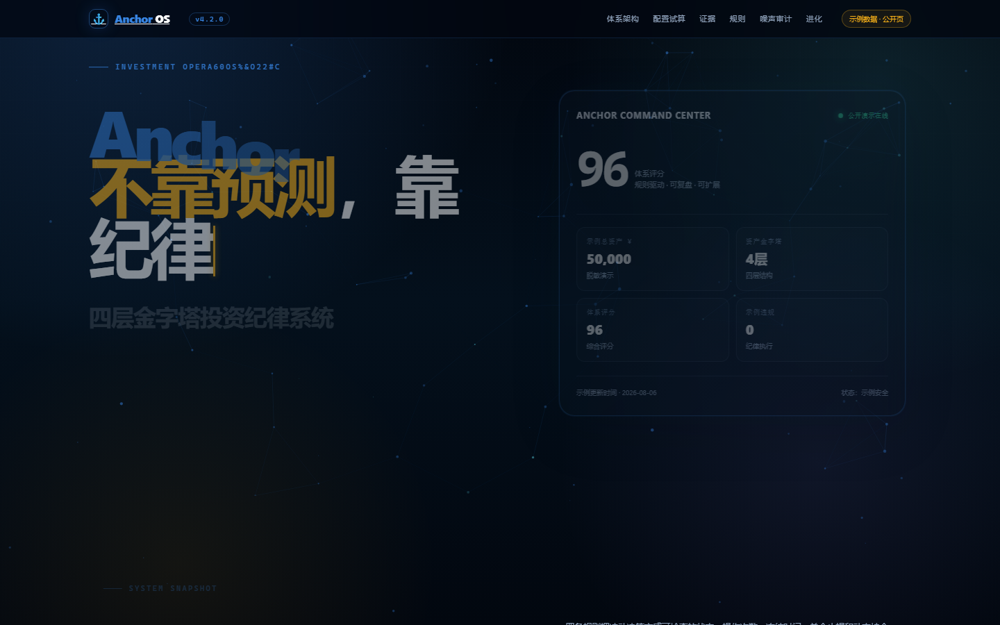
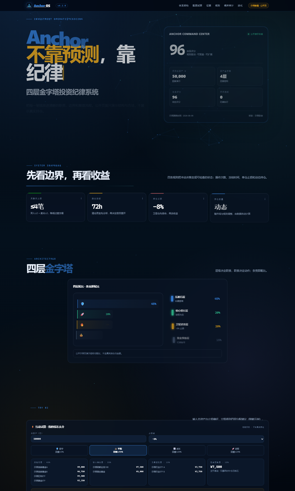

# Anchor

[](https://github.com/killian99cm/anchor-system/actions/workflows/ci.yml)
[](https://killian99cm.github.io/anchor-system)
[](LICENSE)

| 109 live trades | 80% decision accuracy | 0% chase violations | 13 mo track record |
|:---:|:---:|:---:|:---:|
| 实操交易笔数 | 决策判定准确率 | 追高违规次数 | 持续运行记录 |

<!-- 数据来源：05-scripts/transaction_ledger.md（2026-06~07 台账）/ 06-dashboard/decision_log.json（16/20 correct）/ 月度归因_2026年7月 -->

Anchor 是一套面向个人投资者的**规则驱动投资管理系统**。

它把个人投资流程变成一套可重复执行的工作流：

- 维护四层金字塔配置
- 把纪律规则编码成可执行检查
- 从单一持仓数据文件生成私有本地看板
- 在不暴露真实持仓的前提下发布脱敏公开示例页

## Anchor 是做什么的

Anchor 把三件事合成一个系统：

1. **组合结构** —— 压舱石 / 核心增长 / 卫星进攻 / 现金预备
2. **规则执行** —— 回撤线、月操作限制、冻结状态、动态持仓合同
3. **输出界面** —— 私有看板、公开示例页、快照和 smoke 验证

它**不是**：

- 选股引擎
- 自动交易机器人
- 用来公开保存真实持仓的仓库

---

## 界面预览





---

## 公开与私有的边界

Anchor 明确分成两部分。

### 私有、本地保留

这些只留在你自己的电脑上，不应推送到 GitHub：

- 真实 `portfolio_data.json`
- 本地复盘、规则、策略笔记、记忆备份
- 由真实持仓生成的私有看板输出

### 公开、可分享

这些可以安全发布：

- 不包含私人数据的脚本代码
- 脱敏示例输入：`06-dashboard/portfolio_data_example.json`
- 公开体系页：`08-website/anchor-pro.html`
- GitHub Pages 示例首页：`06-dashboard/portfolio_analysis_example.html`

仓库已经按这个原则配置：**私有工作区留本地，公开资产可分享。**

---

## 三个核心页面

### 私有看板

由你本地的真实持仓数据生成。

主要输出：

- 桌面 `portfolio_analysis.html`

用途：

- 每日决策
- 风险复查
- 仓位检查
- 周/月复盘支持

### 公开体系总览页

- `08-website/anchor-pro.html`

用途：

- 对外解释 Anchor 方法论
- 展示结构与规则模型
- 公开分享脱敏版本

### GitHub Pages 示例首页

- `06-dashboard/portfolio_analysis_example.html`

用途：

- 公开首页
- 示例看板展示
- 在线演示入口

---

## 快速开始

### 第一步：克隆仓库

```bash
git clone https://github.com/killian99cm/anchor-system.git
cd anchor-system
```

### 第二步：创建本地私有数据文件

先用示例文件做模板：

```bash
cp 06-dashboard/portfolio_data_example.json portfolio_data.json
```

然后把其中的示例值改成你自己的真实持仓，**只在本地修改**。

### 第三步：生成私有看板

```bash
python "05-scripts/rebuild.py"
```

这会根据你本地的真实数据生成私有输出。

### 第四步：打开看板

打开：

- `portfolio_analysis.html`

这是你每天使用的主驾驶舱。

---

## 每日使用流程

### 更新本地数据

把最新收盘、持仓变化和备注更新进本地 `portfolio_data.json`。

### 重建输出

运行：

```bash
python "05-scripts/rebuild.py"
```

### 查看私有看板

重点看：

- 顶部决策条
- KPI 矩阵
- 四层偏离
- 风险板
- 待办队列
- 趋势卡片

### 规则通过后再操作

交易前用看板确认：

- 当前状态
- 是否冻结
- 是否触发回撤线
- 本月操作数
- DDX / 溢价率 / 时间止损 等专项规则

---

## 每周使用流程

每周至少做一次：

- 检查四层占比
- 扫描红灯和待办
- 看有没有层级漂移
- 根据本地流程生成并阅读周报

---

## 每月使用流程

每月做一次：

- 月度归因
- 回顾哪些规则保护了你
- 回顾哪些规则触发太晚或太频繁
- 只有在真实行为和复盘证据支撑下，才修改系统

---

## 公开页生成

如果你要刷新脱敏公开页面，运行：

```bash
python "05-scripts/gen_anchor_pro.py"
```

它会同步更新：

- `08-website/anchor-pro.html`
- `06-dashboard/portfolio_analysis_example.html`

公开生成器只会使用脱敏示例数据，并检查私人信息泄漏。

---

## 验证

发布前或大改动后，运行 smoke：

```bash
python "05-scripts/smoke_test.py"
```

它会检查：

- rebuild 输出是否存在
- 快照是否一致
- 公开页是否仍然脱敏
- 动态持仓合同是否存在
- 内嵌脚本是否还能正确解析
- GitHub Pages 示例首页是否仍然有效

---

## 关键脚本

- `05-scripts/data_processor.py` —— 计算状态、回撤、风险、冻结和层级合同
- `05-scripts/rebuild.py` —— 用本地真实数据生成私有看板
- `05-scripts/gen_anchor_pro.py` —— 把脱敏示例数据注入公开页
- `05-scripts/smoke_test.py` —— 验证输出完整性和隐私边界
- `05-scripts/gen_monthly_attribution.py` —— 支持月度归因流程
- `05-scripts/test_calculations.py` —— 验证核心计算逻辑

---

## 用户从发现项目到使用的完整路径

1. 在 GitHub 上看到项目
2. 阅读公开 README 和公开演示页
3. 克隆仓库
4. 创建本地私有 `portfolio_data.json`
5. 运行 `rebuild.py`
6. 打开私有看板
7. 每天收盘后使用看板更新和检查
8. 每周做仓位点检
9. 每月做归因复盘
10. 对外分享时只使用公开脱敏页面，不暴露真实持仓

---

## 隐私说明

这个仓库遵守一个硬边界：

> **真实持仓只留本地，GitHub 公开页只使用脱敏示例数据。**

如果你使用 Anchor，请把真实持仓留在本机，只发布公开示例资产。
